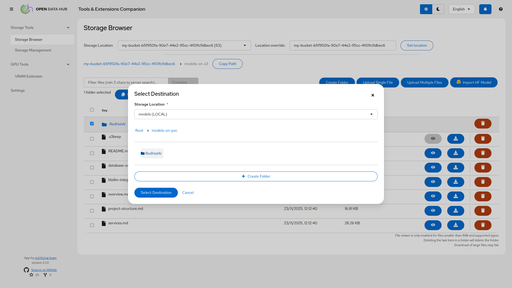
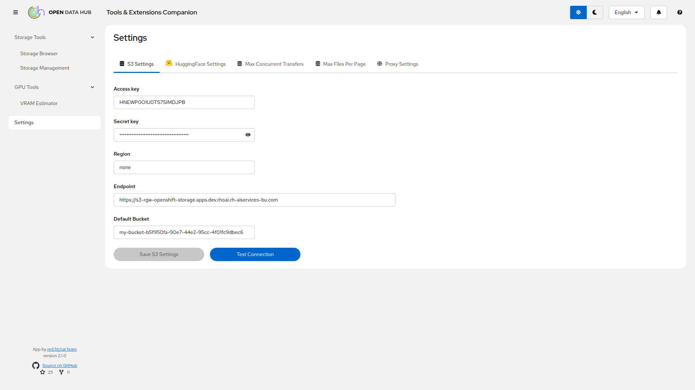

# Open Data Hub Tools &amp; Extensions Companion

This application implements a unified storage management platform and tools that can be useful to anyone working with Open Data Hub (ODH), Red Hat OpenShift AI (RHOAI), or even locally with Podman. It supports both S3-compatible object storage and local filesystem storage (PVC mounts), providing seamless file management across different storage types.

## Current Features

### Storage Management

The application provides a unified interface for managing both S3-compatible object storage and local filesystem storage (PVC mounts):

**S3 Storage:**

- Bucket management: browsing, creation, deletion
- Object operations: upload, download, delete, preview
- Advanced pagination supporting buckets with >1,000 objects
- Server-side filtering for improved performance

**Local Storage (PVC):**

- Browse and manage files on mounted Persistent Volume Claims or any mounted volume in a container
- Directory creation and navigation
- File upload, download, deletion, preview
- Secure path validation with protection against directory traversal attacks

**Cross-Storage Operations:**

- Transfer files and folders between S3 and local storage
- Copy between different S3 buckets or local locations
- Folder/directory transfers with structure preservation
- Real-time transfer progress with Server-Sent Events (SSE)
- Conflict resolution (overwrite, skip, rename) for existing files
- Concurrent transfer queue with configurable limits

**HuggingFace Integration:**

- Import models from HuggingFace to S3 or local storage
- Streaming downloads with minimal memory usage (~256MB for 7B models, ~512MB for 120B models)
- Real-time progress tracking

**File Management:**

- Multi-file upload and download
- File preview for supported formats
- File type validation with configurable allow/block lists
- Configurable file size limits (default: 20GB)

### GPU Tools

- VRAM Estimator: helps you calculate the VRAM and number of GPUs you need for inference and training.

### Settings and Validations

- S3 connection testing
- HuggingFace authentication testing
- Runtime configuration with ephemeral overrides (not persisted to environment)

## Screenshots

The application provides powerful storage management and GPU tools for Open Data Hub users:

**Storage Management - Unified View:**


*Manage both S3 buckets and PVC storage from a unified interface*

**HuggingFace Model Import:**


*Stream models directly from HuggingFace to S3 or PVC storage with real-time progress tracking*

**File Preview:**


*Preview files directly in the browser without downloading*

**Cross-Storage Transfers:**



*Transfer files and folders between S3 and PVC storage seamlessly*

**VRAM Estimator:**


*Calculate GPU memory requirements for model inference and training*

**Settings:**



*Configure S3, HuggingFace, and other application settings*

For detailed usage instructions and workflows, see [Usage Guide](docs/usage.md).

## Deployment

A container image of the application is available at: `quay.io/rh-aiservices-bu/odh-tec:latest`

It can be imported as a custom workbench in ODH or RHOAI, used in a standard OpenShift Deployment, or launched locally with Podman (see below).

All file transfers (computer↔backend↔S3, computer↔backend↔local storage, S3↔local storage, or HuggingFace→S3/local) are fully streamed, meaning no intermediate storage is used and RAM consumption stays minimal (256MB peak when importing a 7B model from HuggingFace). The maximum number of concurrent file transfers is configurable via `MAX_CONCURRENT_TRANSFERS` (default: 2). Increasing this value will increase memory usage proportionally.

### Workbench in ODH or RHOAI

- An admin must Import the custom image.
- Create the Workbench (1 CPU/1GB RAM is more than enough).
- **For S3 Storage**: Optionally attach an existing Data Connection to automatically configure S3 credentials.
- **For Local Storage**: Optionally attach one or more Persistent Volume Claims (PVCs) to the workbench. The paths you want to access through the application need to be set in the `LOCAL_STORAGE_PATHS` environment variable (see below).
- Configure environment variables as needed:
  - `HF_TOKEN`: Your HuggingFace token for model imports
  - `LOCAL_STORAGE_PATHS`: Comma-separated list of mounted PVC paths (e.g., `/opt/app-root/src/data,/opt/app-root/src/models`)
  - `MAX_CONCURRENT_TRANSFERS`: Maximum concurrent transfers (default: 2)
  - `MAX_FILE_SIZE_GB`: Maximum file size in GB (default: 20)
- Launch the Workbench.
- If you have not attached a Data Connection or set Environment variables when creating the Workbench, you can always set the parameters through the Settings menu in the application (except PVCs paths). However, those custom values will be valid only as long as the pod is running.
- The application supports the `NB_PREFIX` environment variable to set a specific URL path to serve the application from. This makes it compatible with the new OpenShift AI 3.x routing mechanism for workbenches.

### Standard Deployment in OpenShift

- Create a standard Deployment of the image, with the associated Service and Route.
- Add the Environment variables you need, following the example in the [env file](./backend/.env.example).
- **For Local Storage**: Mount PVCs to the deployment and configure the `LOCAL_STORAGE_PATHS` environment variable:

  ```yaml
  apiVersion: apps/v1
  kind: Deployment
  metadata:
    name: odh-tec
  spec:
    template:
      spec:
        containers:
        - name: odh-tec
          image: quay.io/rh-aiservices-bu/odh-tec:latest
          env:
          - name: LOCAL_STORAGE_PATHS
            value: "/mnt/data,/mnt/models"
          - name: MAX_FILE_SIZE_GB
            value: "20"
          volumeMounts:
          - name: data-storage
            mountPath: /mnt/data
          - name: model-storage
            mountPath: /mnt/models
        volumes:
        - name: data-storage
          persistentVolumeClaim:
            claimName: data-pvc
        - name: model-storage
          persistentVolumeClaim:
            claimName: models-pvc
  ```

- If you have not set Environment variables when creating the Deployment, you can always set the parameters through the Settings menu in the application. However, those custom values will be valid only as long as the pod is running.

### Local usage with Podman

- Create a `.env` file following [the example](./backend/.env.example).
- **For S3-only usage**, launch the application with:

  ```bash
  podman run --rm -it -p 8888:8888 --env-file=.env quay.io/rh-aiservices-bu/odh-tec:latest
  ```

- **For local storage support**, mount local directories as volumes and set `LOCAL_STORAGE_PATHS` in your `.env` file:

  ```bash
  # In your .env file, add:
  LOCAL_STORAGE_PATHS=/opt/app-root/src/data,/opt/app-root/src/models

  # Then run with volume mounts:
  podman run --rm -it -p 8888:8888 \
    --env-file=.env \
    -v ./local-data:/opt/app-root/src/data:Z \
    -v ./local-models:/opt/app-root/src/models:Z \
    quay.io/rh-aiservices-bu/odh-tec:latest
  ```

  Note: The `:Z` suffix is required for SELinux systems to properly label the volumes.

- Open your browser at <http://127.0.0.1:8888>
- If you don't create the environment file, you can always set the parameters through the Settings menu in the application. However, those custom values will be valid only as long as the pod is running.

### Configuration

The application can be configured using environment variables. A complete example is available in [backend/.env.example](./backend/.env.example).

#### S3 Storage Configuration

When used as a workbench in ODH or RHOAI, you can attach a Data Connection and the S3 credentials will be automatically picked up. Otherwise, configure these variables:

- `AWS_ACCESS_KEY_ID`: S3 access key
- `AWS_SECRET_ACCESS_KEY`: S3 secret key
- `AWS_DEFAULT_REGION`: S3 region (default: us-east-1)
- `AWS_S3_ENDPOINT`: S3 endpoint URL for S3-compatible storage
- `AWS_S3_BUCKET`: Default S3 bucket name

#### Local Storage Configuration

- `LOCAL_STORAGE_PATHS`: Comma-separated list of allowed local storage paths (default: `/opt/app-root/src/data`)
  - Example: `/mnt/data,/mnt/models,/opt/app-root/src/workspace`
  - These paths must be mounted as volumes for local storage to work

#### File Transfer Configuration

- `MAX_CONCURRENT_TRANSFERS`: Maximum number of concurrent file transfers (default: 2)
  - Increasing this will increase memory usage
- `MAX_FILE_SIZE_GB`: Maximum file size for uploads and transfers in GB (default: 20)
- `MAX_FILES_PER_PAGE`: Maximum files per page for pagination (default: 100)

#### File Validation Configuration

- `ALLOWED_FILE_EXTENSIONS`: Override default allowed file extensions (comma-separated)
- `ALLOWED_FILE_EXTENSIONS_APPEND`: Append to default allowed extensions (comma-separated)
- `BLOCKED_FILE_EXTENSIONS_APPEND`: Append to default blocked extensions (comma-separated)

Default allowed extensions include model files (.safetensors, .bin, .pt, .pth, .onnx, .gguf), data files (.csv, .json, .parquet), archives (.tar, .gz, .zip), documents (.pdf, .docx), images (.jpg, .png), and more.

#### HuggingFace Configuration

- `HF_TOKEN`: Your HuggingFace API token for model imports

#### Security Configuration

- `DISABLE_AUTH`: Disable JWT authentication (default: true, application is designed for external authentication and access control mechanism like OAuth proxy)
- `JWT_SECRET`: JWT secret key for token signing (required if authentication is enabled)
- `ALLOWED_ORIGINS`: Comma-separated list of allowed CORS origins (default: <http://localhost:8888,http://localhost:3000>)

#### Other Configuration

- `NB_PREFIX`: URL path prefix for Gateway API/Ingress routing (e.g., `/my-app`)
- `HTTP_PROXY`, `HTTPS_PROXY`, `NO_PROXY`: Proxy configuration for enterprise environments

#### Runtime Configuration

At any time, you can modify S3 connection settings and HuggingFace token through the **Settings** menu in the application. These changes are ephemeral and only valid while the container is running. No modifications are made to the original Data Connection or environment variables.

## Development

- Requirements: NodeJS 18 minimum.
- From the root folder of the repo, run `npm install` to install all the required packages both for the frontend and the backend.
- In both `backend` and `frontend` folders, copy the `.env.example` files to `.env` and adjust the values in the `backend` one to your liking.
- Launch the application in development mode with `npm run dev`.
- **Testing with URL path prefix**: Set `NB_PREFIX=/my-app` in `.env` to test path-based routing locally (useful for Gateway API, Ingress testing). See [Development Workflow](docs/development/development-workflow.md#testing-with-url-path-prefix) for details.
